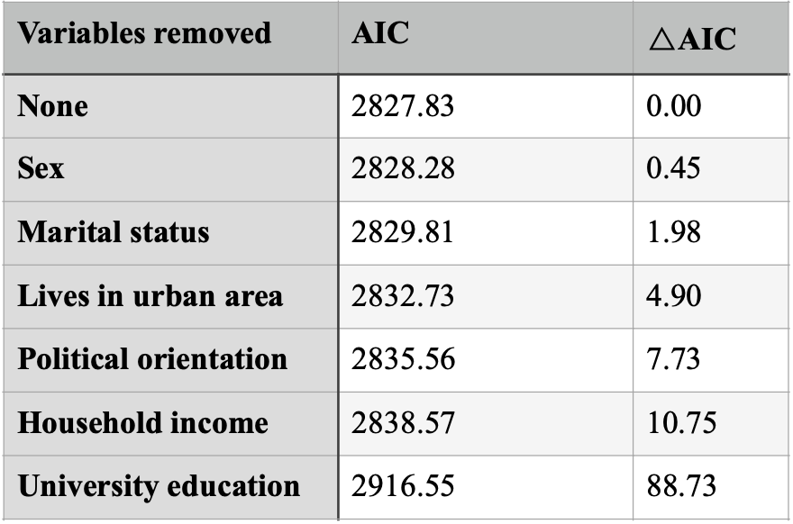
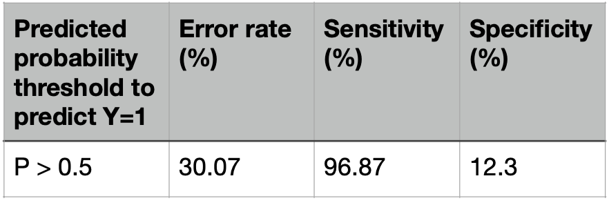
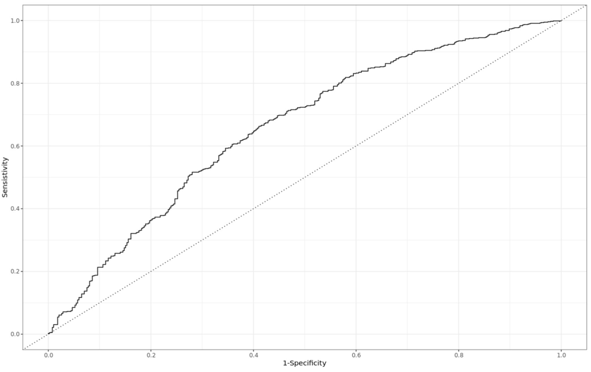
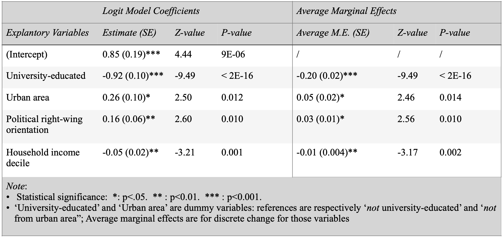
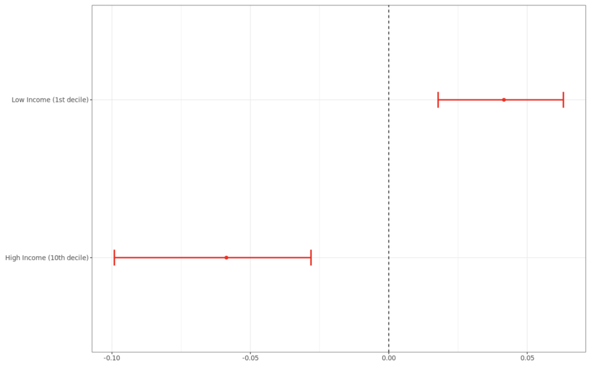

# Predicting Support for Longer Prison Sentences

The campaign advocating shorter prison sentences is targeted at people who most strongly support longer prison sentences. This report presents the characteristics of such groups, exploring an excerpt from the 2018 British Social Attitudes Survey recording 2347 observations of 9 variables. The extent to which individual characteristics matter in predicting support for longer sentences is also detailed to help measure the likely effectiveness of the campaign.

## Measures

### Output: Support for Longer Prison Sentences

The logit model used in this report predicts support for longer prison sentences. The respondents’ opinions on the matter were coded as a binary variable: they either support longer sentences or do not.

### Explanatory Variables

Variable selection is governed by a theoretical reasoning based on knowledge of the study system. Only characteristics that could be logically connected to the respondents’ opinion regarding longer prison sentences are considered. The process is also guided by statistical tools such as the Akaike information criterion (AIC) and the area under the Receiver Operating Characteristics (ROC) curve.

A first logit model controlling for all variables reveals that age and belonging to the working- class do not significantly affect support for longer prison sentences. Even though lack of statistical significance is not sufficient to eliminate variables from a model, the absence of logical connection between those characteristics and the variable of interest further justifies their elimination. The Akaike Information Criterium (AIC) evaluates the explanatory power of models while penalizing the use of many independent variables. While its value is not interpretable, comparing them is a common method used in model selection. Observing the effects on the AIC of removing variables from a model allows to highlight their impact on the model fit, considering the added complexity.

*Table 1. Comparison of Model AICs*

The AIC puts more more emphasis on model performance and tends to penalize complex models less than other methods such as the Bayesian Information Criterion (Murphy, 2012: 162). This can explain the good performance of the full model here. A simple rule of thumb determines that models with 􏰀AIC < 2 have substantial support while those for which 􏰀AIC > 4 have considerably less support (Burnham & Anderson, 2004). Because the variable for sex hardly improves the model fit and would add complexity to the statistical analysis, it is not included in the final model.

The final step of model selection consisted of assessing the effects on the bias-variance balance of including marital status, potential interaction terms or transformations using confusion matrices and the area under ROC curves. Marital status was eliminated and no transformations or interactions were deemed necessary.

### Model performance

The model used in this report maximizes explanatory power with limited complexity to make campaign targeting clearer and easier. It includes geographical (whether or not people live in urban areas), political, economic (household income), and education characteristics. Model performance was assessed on test data after having fitted the model on training data.

*Table 2. Model Performances (test data)*

*Fig 1. Receiver Operating Characteristics Curve*

## Findings of the logit model

### Predicting support for longer prison sentences

Results from the logistic regression model fitted on the entire dataset (Table 3) display that, while controlling for other variables, living in an urban area, and a right-wing political orientation are correlated with higher support for longer prison sentences. On the contrary, university education and higher household incomes are associated with lower support for longer prison sentences. These relationships are all statistically significant (α=0.05).

These findings indicate that groups of people that are most supportive of longer prison sentences, and therefore should be targeted by the campaign, mostly live in urban areas, lack university education and do not benefit from high household incomes. Moreover, people tending to the right -hand side of the political spectrum should be targeted according to the objectives of the campaign.

### Explanatory power of characteristics

Average marginal effects are good indicators of the strength of the correlation between the model’s predictors and support for longer prison sentences. Here, they are all are statistically significant with a 95% confidence interval. Living in an urban area is, on average, correlated with a 5% increase in the probability of supporting longer prison sentences. More remarkable is the 20% decrease of doing so after having benefitted from university education.

Average marginal effects are based on each variable’s unit; they are not dependable measures but rather instruments subject to the interpretation of the analyst. For example, the effect of a one unit change in household income decile cannot be compared to the effect of a one unit change on the 1-5 scale measuring political orientation.

Changes in predicted probabilities can be complementary in the evaluation of the extent to which variables matter in predicting support for longer sentences. On average, people from the lowest income decile are 10% more likely to support longer prison sentences than those from the highest decile (Figure 2). This preference is statistically significant as the 95% confidence interval of this difference [0.04; 0.17] does not include 0, allowing to reject the null hypothesis that there is no difference in probabilities between both groups. Similarly, given a certain profile, an extreme shift of political orientation to the right is associated, on average, with a statistically significant 12% jump in the probability of support for longer sentences.

*Table 3. Logit Regression Analysis Predicting Support for Longer Prison Sentences*

*Fig 2. Predicted Differences in Probabilities of Supporting Longer Prison Sentences Relative to Median Household Income (95% CI)*

## Conclusion

Considering the results of the model discussed above, the campaign would be more efficient in urban areas. It should be targeted at households in the lower deciles of income and/or whose political orientation leans to the right-wing. No clear difference in the extent to which those two characteristics matter in explaining support for longer sentences could be uncovered. However, a particular focus should be devoted people lacking university education, this characteristics being the most instrumental in explaining support for longer prison sentences.

The relatively poor performance of the model — very low specificity and area under the ROC curve of 0.66 — can be partially explained by the limited range of variables in the original dataset. Considering other characteristics such as religious beliefs could improve the explanatory power of models, and the efficiency of campaign targeting.